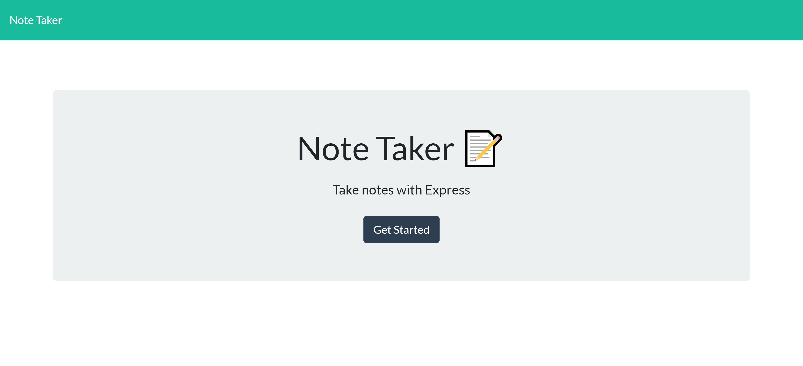
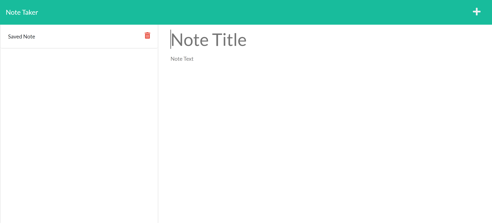

# Note Taker

## Table of Contents:

### [Description](#description-header)

### [Installation](#installation-header)

### [Usage](#usage-header)

### [Licence](#licence-header)

### [Credits](#credits-header)

### [Questions](#questions-header)

---

 

##  Description

CRUD is an absolutely essential aspect of web-development. To better learn and master CRUD HTML methods - namely, GET, POST, PUT, and DELETE - a Note Talker with broken code was refactored and made fully-functional.

The purpose of this Note Taker is essentially that of a simple to-do-list. A user can create, retrieve, and delete notes.

 

##  Installation

No installation necessary! To access the application, click on the link [here](https://note-taker-dev.herokuapp.com/).

 

##  Usage

Simply write the title and body of a note to be saved and click on the save icon on the upper right corner. All saved notes shall appear on the left, which can then be retrieved by clicking on the body of the text. To delete, click the red trash icon on the notes tab.

 

___

 

##  Credits

Credit goes to the UTA Bootcamp for providing instruction and tools for learning Full-Stack Web Development.

 

##  Licence

Note Taker is released under the MIT licence.

---

##  Questions

For more information and suggestions you can contact me at caperez317@gmail.com.

For a list of other projects and repos visit https://github.com/cperezba

